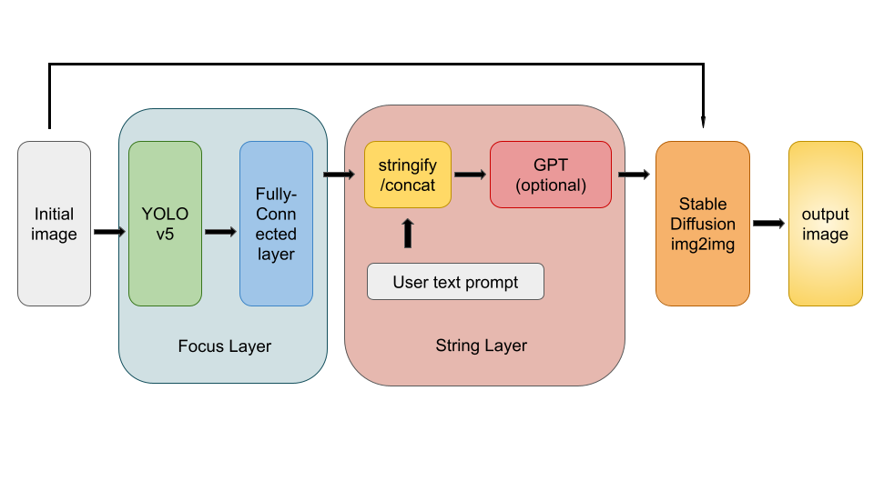
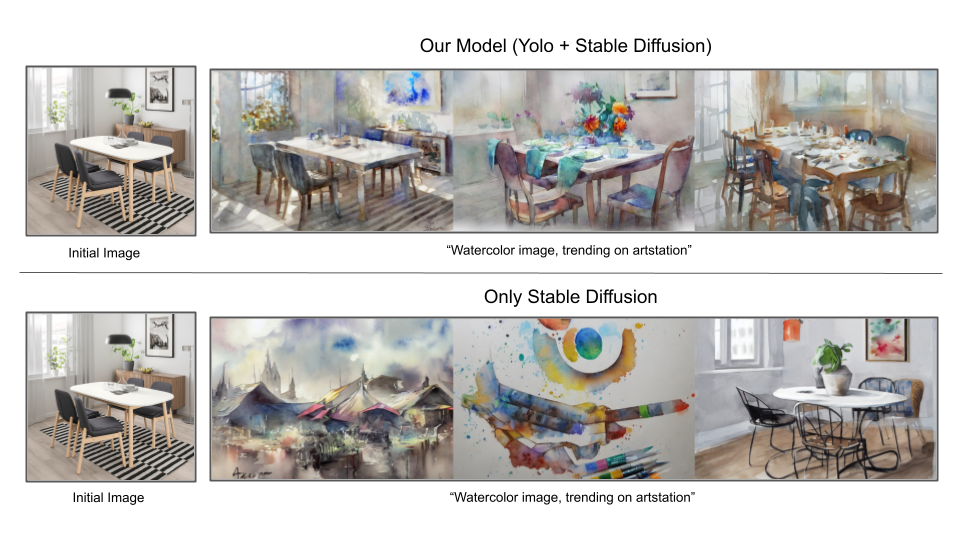

# 이미지 생성 모델의 프롬프트를 위한
# 적응적 선택과 집중 계층 구조

위 코드 및 자료는 KSC 2023에 제출한 학부생논문 실험 및 결과를 담은 코드이다.

해당 자료는 [학부생논문](https://drive.google.com/file/d/1bjbJ--zeCEKiWOI-2mysC-P1AWlChcm_/view?usp=sharing) 을 클릭하여 볼 수 있다.

## 간단 소개

위 학부생논문의 모델은 img2img 생성 모델을 좀 더 사용자 친화적으로 개선한 모델이다.

주 원리는 사물인식 모델을 사용하여 사용자의 이미지 내의 핵심 사물을 파악하여 사용자의 프롬프트를 개선하는 방식이다.

다음 그림은 모델의 전체 구조이다

다음 그림은 본 모델을 사용했을 때와 그렇지 않았을 때를 비교한 자료이다.

## 직접 실행

1. YoloDiffusionPaper.ipynb 를 **Colab**에서 실행한다.

2. "Yolov5 필요라이브러리"까지 실행한다.

3. yolov5 파일 아래로 imp_detect.py 와 saved_model 파일을 옮겨준다.

4. 핵심 요소 파약 딥러닝구조 제작 단계는 건너뛰어준다.

5. YoloDiffusion Start부터 코드를 실행해준다.

6. GPT 사용어부는 Optional이지만 사용한다면 본인의 GPT 키를 발급받아 사용하기를 바란다.

7. 마지막 코드는 3개씩 이미지를 출력하기 위한 코드이다.

## 기타

문의는 overwindow@khu.ac.kr로 연락바랍니다.
